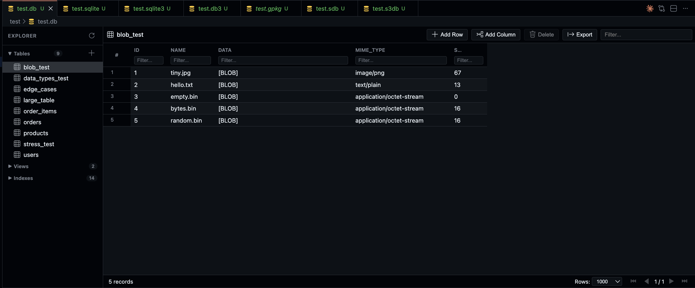

# SQLite Explorer

A powerful, open-source SQLite database viewer and editor for Visual Studio Code.

**[Try it in your browser](https://vscode-sqlite-explorer.vercel.app/demo)** | **[Website](https://vscode-sqlite-explorer.vercel.app/)**



## Demos

### Inline Editing
Double-click any cell to edit. Add new rows and delete existing ones with ease.


### Pin Columns
Keep important columns visible while scrolling horizontally through wide tables.


### Pin Rows
Pin rows to the top for easy reference while navigating through data.


### Large Tables
Handle tables with thousands of rows smoothly with virtualized scrolling.


## Features

### Database Viewing
- **Open SQLite files directly** - Supports `.sqlite`, `.db`, `.sqlite3`, `.db3`, `.sdb`, `.s3db`, and `.gpkg` formats
- **Schema browser** - Explore tables, views, and indexes in a clean sidebar
- **Virtualized scrolling** - Handle large tables with thousands of rows smoothly
- **Column sorting** - Click headers to sort ascending/descending
- **Column filtering** - Filter data in real-time with per-column search
- **Pagination** - Navigate through large datasets efficiently
- **SQL Logging** - View executed queries in the Output panel for debugging

### Inline Editing
- **Double-click to edit** - Modify cell values directly in the table view
- **VS Code Editor Integration** - Edit large cell values (JSON, SQL) in a full VS Code editor tab
- **Batch Updates** - Update specific columns for multiple selected rows simultaneously
- **Row operations** - Insert new rows and delete existing ones
- **Drag & Drop** - Upload files as BLOBs by dragging them onto cells
- **Undo/Redo support** - Full edit history with Ctrl+Z / Ctrl+Y

### Advanced Features
- **Database Settings** - Configure SQLite pragmas (WAL mode, Foreign Keys, etc.) via a GUI
- **JSON Patching** - Smart updates for JSON fields using RFC 7396 Merge Patching
- **Export** - Export tables or selection to CSV, JSON, SQL, or Excel formats


### Cross-Platform
- **WebAssembly-powered** - Uses sql.js for universal compatibility
- **Native SQLite support** - Optional native backend for better performance on desktop
- **VS Code for Web** - Works in browser-based VS Code environments
- **Remote development** - Full support for SSH, WSL, and containers

### UI/UX
- **Theme integration** - Automatically matches your VS Code color theme
- **Responsive layout** - Resizable sidebar and table columns
- **Keyboard navigation** - Full keyboard support for power users
- **Multi-language** - Localized in 14 languages

## Installation

1. Open VS Code
2. Go to Extensions (Ctrl+Shift+X)
3. Search for "SQLite Explorer"
4. Click Install

Or install from the command line:
```bash
code --install-extension zknpr.sqlite-explorer
```

## Usage

1. **Open a database** - Simply open any SQLite file in VS Code
2. **Browse schema** - Use the sidebar to navigate tables and views
3. **View data** - Click a table to display its contents
4. **Edit cells** - Double-click any cell to modify its value
5. **Save changes** - Press Ctrl+S to save modifications

## Keyboard Shortcuts

| Shortcut | Action |
|----------|--------|
| `Enter` | Save cell edit |
| `Escape` | Cancel cell edit |
| `Ctrl+C` / `Cmd+C` | Copy selected rows |
| `Ctrl+Z` / `Cmd+Z` | Undo |
| `Ctrl+Y` / `Cmd+Shift+Z` | Redo |
| `Ctrl+S` / `Cmd+S` | Save database |

## Configuration

| Setting | Default | Description |
|---------|---------|-------------|
| `sqliteExplorer.maxFileSize` | `200` | Maximum file size in MB (0 = unlimited) |
| `sqliteExplorer.defaultPageSize` | `1000` | Rows per page |
| `sqliteExplorer.maxRows` | `0` | Maximum rows to load (0 = unlimited) |
| `sqliteExplorer.instantCommit` | `never` | Auto-save strategy (`always`, `never`, `remote-only`) |
| `sqliteExplorer.doubleClickBehavior` | `inline` | Double-click action (`inline`, `modal`, `vscode`) |

## Supported File Types

- `.sqlite` - SQLite database
- `.sqlite3` - SQLite 3 database
- `.db` - Database file
- `.db3` - SQLite 3 database
- `.sdb` - SQLite database
- `.s3db` - SQLite 3 database
- `.gpkg` - GeoPackage (SQLite-based)

## Requirements

- VS Code 1.83.1 or higher
- No external dependencies required

## License

MIT License - see [LICENSE.md](LICENSE.md) for details.

## Development

This extension was built from scratch using **Claude Opus 4.5** (with extended thinking). The entire codebase - including the RPC system, database engine wrapper, UI components, and localization - was independently developed.

### Architecture

```
┌─────────────────┐     ┌─────────────────┐     ┌─────────────────┐
│    Webview      │ ←→  │  Extension Host │ ←→  │     Worker      │
│  (viewer.html)  │     │  (extension.ts) │     │   (worker.ts)   │
└─────────────────┘     └─────────────────┘     └─────────────────┘
        ↑                       ↑                       ↑
    UI Layer              VS Code API             SQLite WASM
```

### Building from Source

```bash
# Clone the repository
git clone https://github.com/zknpr/sqlite-explorer.git
cd sqlite-explorer

# Install dependencies
npm install

# Build the extension
npm run build

# Package as .vsix
npm run package
```

## Contributing

Contributions are welcome! Please feel free to submit issues and pull requests.

## Support

If you find this extension useful, please consider buying me a coffee!

<a href="https://buymeacoffee.com/zknpr">
  
</a>

## Credits

- **SQL.js** - WebAssembly SQLite implementation
- **VS Code Codicons** - Icon font
- **Icon** - [SQLite](https://iconscout.com/3d-icons/sqlite) by [Toms Design](https://iconscout.com/contributors/tomsdesign)
- Built from scratch with **Claude Opus 4.5** (extended thinking)

---

**Made with AI assistance by [Claude Code](https://claude.com/product/claude-code)**
