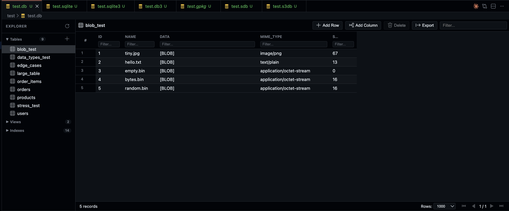
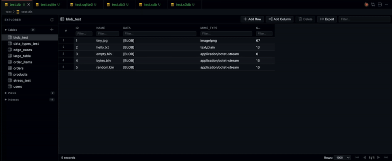
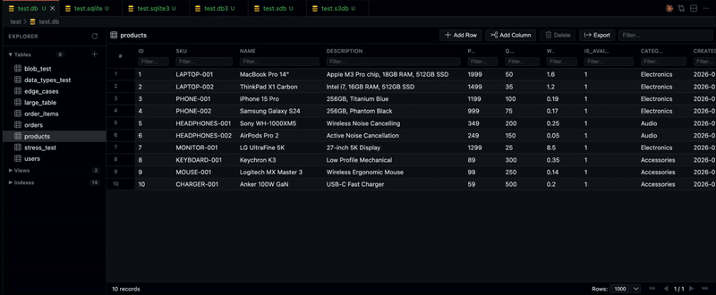

# SQLite Explorer

A powerful, open-source SQLite database viewer and editor for Visual Studio Code.

**[Try it in your browser](https://sqlite-explorer.zknpr.xyz/demo)** | **[Website](https://sqlite-explorer.zknpr.xyz/)** | **[Changelog](CHANGELOG.md)**



## Demos

### Inline Editing
Double-click any cell to edit. Add new rows and delete existing ones with ease.



### Pin Columns
Keep important columns visible while scrolling horizontally through wide tables.



### Pin Rows
Pin rows to the top for easy reference while navigating through data.


### Large Tables
Handle tables with thousands of rows smoothly with pagination.


## Features

### Database Viewing
- **Open SQLite files directly** — Supports `.sqlite`, `.db`, `.sqlite3`, `.db3`, `.sdb`, `.s3db`, and `.gpkg` formats
- **Schema browser** — Explore tables, views, and indexes in a sidebar with search filtering
- **Pagination** — Navigate large datasets with configurable page sizes (100–100,000 rows)
- **Column sorting** — Click headers to sort ascending/descending
- **Column & global filtering** — Per-column search and full-table text search
- **Pin columns & rows** — Keep important data visible while scrolling
- **SQL logging** — View all executed queries (reads and writes) in the VS Code Output panel

### Editing
- **Inline cell editing** — Double-click any cell to modify its value
- **VS Code editor integration** — Edit large values (JSON, SQL, text) in a full VS Code editor tab
- **Batch updates** — Update a column for multiple selected rows simultaneously via the sidebar
- **Row operations** — Insert new rows, delete selected rows
- **Column operations** — Add columns (with type and default value), delete columns
- **Table creation** — Create new tables with structured column definitions
- **Drag & drop BLOBs** — Upload files as binary data by dragging them onto cells
- **Smart JSON patching** — Edits to JSON cells use RFC 7396 Merge Patching (only diffs are sent)
- **Full undo/redo** — All operations (cell edits, row/column CRUD, batch updates) are undoable

### Blob Inspector
- **Image preview** — PNG, JPEG, GIF, WebP displayed inline
- **Audio playback** — MP3, WAV, OGG, FLAC with native controls
- **Video playback** — MP4, WebM, MOV with native controls
- **Text/JSON preview** — View and format text and JSON content
- **Hex view** — Inspect raw binary data in hex dump format
- **Download & replace** — Save blobs to disk or upload replacements

### Export
- **Formats** — CSV, JSON, SQL INSERT statements
- **Options** — Include/exclude headers, toggle table name in SQL output
- **Selection export** — Export only selected rows
- **Streaming** — Large exports use streaming and keyset pagination to prevent OOM

### Database Settings
- **Pragma editor** — Configure SQLite pragmas (journal mode, foreign keys, synchronous, cache size, etc.) via GUI
- **Query timeout** — Configurable timeout prevents runaway queries (default 30s)
- **Auto-commit** — Optional instant-save mode for remote workspaces

### Cross-Platform
- **Dual backend** — Native SQLite (txiki-js) for desktop performance, sql.js (WebAssembly) for universal compatibility
- **Automatic fallback** — If the native backend fails (sandboxing, permissions), falls back to WASM transparently
- **VS Code for Web** — Works in browser-based VS Code (vscode.dev)
- **Remote development** — Full support for SSH, WSL, and containers
- **Web demo** — Try it at [sqlite-explorer.zknpr.xyz/demo](https://sqlite-explorer.zknpr.xyz/demo) — all processing is client-side

### UI/UX
- **Theme integration** — Automatically matches your VS Code color theme (light, dark, high contrast)
- **Resizable layout** — Adjustable sidebar and column widths
- **Multi-cell selection** — Click, Shift+Click (range), Cmd/Ctrl+Click (multi), column/row selection
- **Keyboard-driven** — Full keyboard support for editing, navigation, and selection
- **Localized** — 14 languages (EN, DE, ES, FR, IT, JA, KO, NL, PL, PT-BR, RU, TR, ZH-CN, ZH-TW)

### Security
- **Strict CSP** — Nonce-based Content Security Policy, no `unsafe-inline`
- **XSS prevention** — All cell data rendered via `textContent`, never `innerHTML`
- **SQL injection prevention** — Parameterized queries, escaped identifiers, validated SQL types
- **PII masking** — Email, phone, API keys, credit cards, SSNs are redacted in SQL logs
- **Workspace isolation** — File access restricted to the current workspace

## Installation

1. Open VS Code
2. Go to Extensions (`Ctrl+Shift+X`)
3. Search for **"SQLite Explorer"**
4. Click **Install**

Or from the command line:
```bash
code --install-extension zknpr.sqlite-explorer
```

## Usage

1. Open any `.sqlite`, `.db`, or `.sqlite3` file in VS Code
2. Browse tables and views in the sidebar
3. Click a table to display its data
4. Double-click any cell to edit
5. `Ctrl+S` / `Cmd+S` to save changes

## Keyboard Shortcuts

| Shortcut | Action |
|----------|--------|
| `Double-click` | Edit cell (inline, modal, or VS Code tab — configurable) |
| `Enter` | Save cell edit |
| `Escape` | Cancel edit / clear selection |
| `Ctrl+C` / `Cmd+C` | Copy selected cells (tab-separated) |
| `Ctrl+Z` / `Cmd+Z` | Undo |
| `Ctrl+Y` / `Cmd+Shift+Z` | Redo |
| `Ctrl+S` / `Cmd+S` | Save database |
| `Cmd+Delete` / `Ctrl+Delete` | Smart delete (selected columns, rows, or clear cells) |
| `Shift+Click` | Range selection |
| `Cmd+Click` / `Ctrl+Click` | Multi-select |

## Configuration

| Setting | Default | Description |
|---------|---------|-------------|
| `sqliteExplorer.maxFileSize` | `200` | Max file size in MB (0 = unlimited) |
| `sqliteExplorer.defaultPageSize` | `500` | Rows per page |
| `sqliteExplorer.maxRows` | `0` | Max rows to load (0 = unlimited) |
| `sqliteExplorer.instantCommit` | `never` | Auto-save strategy (`always`, `never`, `remote-only`) |
| `sqliteExplorer.doubleClickBehavior` | `inline` | Cell double-click action (`inline`, `modal`, `vscode`) |
| `sqliteExplorer.fileOperations` | `native` | Blob save/upload method (`native`, `web`) |
| `sqliteExplorer.queryTimeout` | `30000` | Query timeout in ms (prevents runaway queries) |
| `sqliteExplorer.maxUndoMemory` | `52428800` | Max undo history memory in bytes (default 50MB) |

## Supported File Types

| Extension | Description |
|-----------|-------------|
| `.sqlite` | SQLite database |
| `.sqlite3` | SQLite 3 database |
| `.db` | Database file |
| `.db3` | SQLite 3 database |
| `.sdb` | SQLite database |
| `.s3db` | SQLite 3 database |
| `.gpkg` | GeoPackage (SQLite-based) |

## Requirements

- VS Code 1.110.0 or higher
- No external dependencies required

## Architecture

```
┌─────────────────┐     ┌─────────────────┐     ┌─────────────────┐
│    Webview       │ ←→  │  Extension Host  │ ←→  │     Worker      │
│  (viewer.html)   │     │   (main.ts)      │     │  (worker.ts)    │
└─────────────────┘     └─────────────────┘     └─────────────────┘
        ↑                       ↑                       ↑
    UI Layer              VS Code API         SQLite (WASM or Native)
```

- **Webview** — Renders the data grid, sidebar, modals, and blob inspector
- **Extension Host** — Manages document lifecycle, RPC bridge, file I/O
- **Worker** — Runs SQLite in a separate thread (sql.js WASM or txiki-js native)

Communication uses a custom RPC protocol with correlation IDs, timeouts, and zero-copy `Transfer` wrappers for binary data.

## Building from Source

```bash
git clone https://github.com/zknpr/sqlite-explorer.git
cd sqlite-explorer

npm install          # Install dependencies
node scripts/build.mjs   # Build extension + worker
npm test             # Run 225 unit tests
npm run package      # Package as .vsix
./install.sh         # Build + package + install to VS Code
```

## Contributing

Contributions are welcome! Please feel free to submit issues and pull requests on [GitHub](https://github.com/zknpr/sqlite-explorer).

## Support

If you find this extension useful, consider supporting development:

<span>
<a href="https://buymeacoffee.com/zknpr">
  
</a>
</span>
<span>
<a href="https://ko-fi.com/zknpr">
  
</a>
</span>

## Credits

- **[sql.js](https://github.com/sql-js/sql.js)** — WebAssembly SQLite implementation
- **[txiki.js](https://github.com/nicolo-ribaudo/txiki.js)** — Native JavaScript runtime (native SQLite backend)
- **[@vscode/codicons](https://github.com/microsoft/vscode-codicons)** — Icon font
- **Icon** — [SQLite](https://iconscout.com/3d-icons/sqlite) by [Toms Design](https://iconscout.com/contributors/tomsdesign)

## License

MIT License — see [LICENSE.md](LICENSE.md) for details.

---

**Built with [Claude Code](https://claude.com/product/claude-code)**
